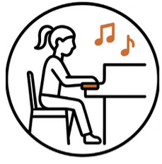
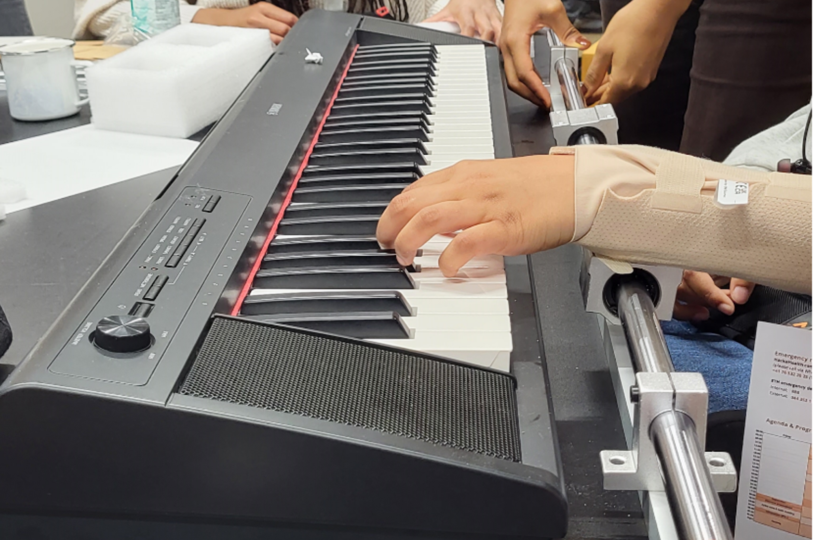
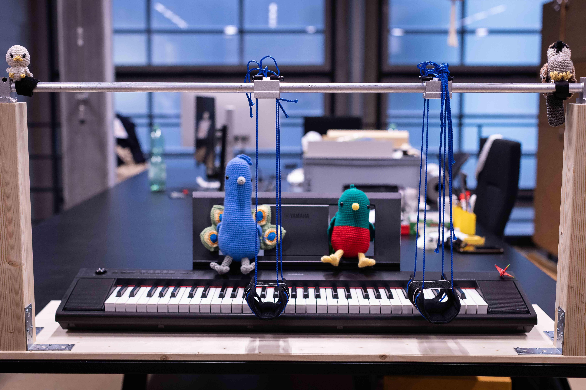
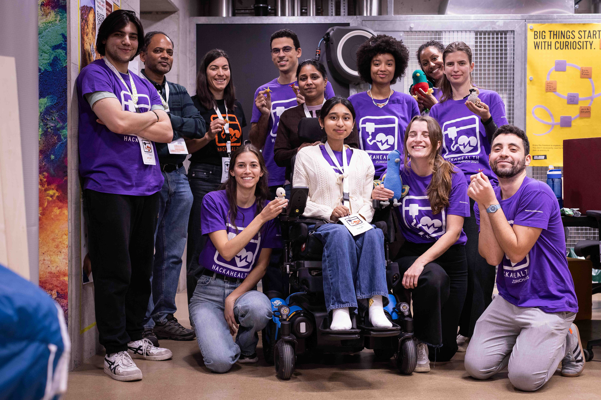

# Sarah-Playing-the-Piano
Summary Hackahealth 2025 Zürich Team Sarah

## Problem Statement
Sarah loves music. She grew up playing the piano. Over time she
lost strength in her arms and now cannot enjoy the instrument she loves anymore.

While she still has mobility in her wrists and fingers, lifting and holding her arms above the keyboard has become too strenuous. To overcome this challenge, Sarah envisions a system that holds her arms and hands in position and guides her natural movements. The system should complement her abilities, reducing fatigue and giving her the freedom to play the piano again.

Even though the initial purpose of the device is for playing the piano, it can easialy be used for other application that require manipulation of objects on a table.

## Requirements & User Needs
As it usually is in rehabilitation engineering, the needs are very user spefic and the final solution is very custom one person's needs, size, preferences... usually leading to wether a very complex system to satisfy the detailed specifications, or a very simple solution that is just so easy that it works. Luckly, what we came up with in this case is the later. 

In this section we describe Sarah's spefic case and the factors we had to consider:

* First simplicity. This was a weekend project, which means limited materials we can aquire and limited development & testing time
* Physiology. Our contestant has limited muscle strength, and gets tired when exerting too much effort. The force in her fingers is not enough to press the piano keys. She preferebly needs a combination of wrist, arm and shoulder motion to be able to play comfortably. This meant we had to provide the following degrees of freedom:
    * Linear guiding of the two hands across the keyboard keys
    * rotation or the wrist arount the horizontal axes (axes of the linear bar in the final solution photo) 
    * rotation of wrist around the vertical axis to allow for smaller hand movement when selecting which key to play.

But we also had to fix the following degrees of freedom:
    * Wrist height with respect to the piano
    * Piano/support height with respect to the user. 

* Form factor. We realized the importance of this point at the end of our first design when we started thinking about how Sarah could take it home, and teh current dimensions were too big to fit into the car. The final structure needs to be compact enough to be stored away when not used and easy to mount by the contestent parents.
* Cost

Our initial idea, as well as some similar products on the market, was to build a support from the buttom that the arm can rest on. Even though this might sound tempting, we quickly started uncovering many of the flows of this design as the complexity of the system keeps increasing as we try to satisfy the requirements stated above. First, the 3d printed parts needed for such a system raise robustness issues. Unfortunately, the polymer materials commonly available cannot be relied on for long-term use knowing that they will have to support the arm weight while also being in motion. Additionally, the number of print iterations needed to find the perfect fit would require too much time, which we don't have during the hackathon weekend. The challenge of this design is to give wrist support and wrist freedom simultanously. 

## Final Solution

This marionet-style setup idea, once we thought about it, was a simple one to test. All we had to do was to hold the linear guide up manually, attach one of the wrist supports we had available with some strings and was done. To our surprise, the feedback from Sarah was very positive. The easy of adjustability of this system made it possible to find a comfortable configuration where the shoulders are relaxed. Sarah had a height adjustable desk at home which is convinient to set the height of the poiano with respect to her chair, then the strings' length can be set to raise teh wrists to the perfect distance from the keys. The rich and smooth motion provided by the string attachement beats by far any stiff mechanical structure that would have to provide teh same degrees of freedom. It also allowed for slight back-and-front "linear" motion that solved the challenge of playing the black and white keys.

## BOM & Reconstruction

* [Linear guide](https://www.amazon.com/BestEquip-Bearing-Bearings-Electronic-Equipment/dp/B082D9BHVN/143-7097979-7607200)
* [Hollow bar](https://www.hornbach.ch/de/p/rohr-m20-alu-3m/7191391/)
* Wooden Bars
* Wooden base
* Long screws/nails to fix the vertical bars (>80mm)
* L-brackets
* Strings
* [Wrist support](https://www.decathlon.ch/en/p/level-5-right-or-left-wrist-support/_/R-p-364505?c=smoked%20black)

The total cost should be less than 150 CHF for the materials.

## The Team

